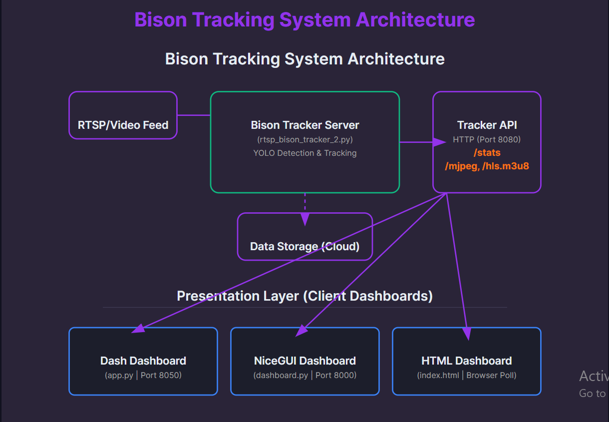

# Bison-Tracking-UI
A python-based Frontend interface for real-time Bison Tracking


# 🦬 Bison-Tracking-UI

<p align="center">
	
</p>

<p align="center">
	<b>A Python-powered, interactive dashboard for real-time Bison Tracking!</b> <br>
	<i>Track, visualize, and analyze bison activity with beautiful live charts and video streams.</i>
</p>

---

## 🚀 Overview


Welcome to the wild side of data! This project brings you:
- **Dash Dashboard** (`app.py`): 📊 Real-time analytics and visualization.
- **NiceGUI Dashboard** (`dashboard.py`): 🎛️ Modern, reactive UI powered by [NiceGUI](https://nicegui.io).
- **HTML Dashboard** (`index.html`): 🌐 Fast, browser-based live stats and video.

Both dashboards visualize bison counts and trends from a video stream or RTSP source, powered by YOLO object detection and tracking. Watch the herd in action!

---


## ✨ Features
- 🟢 Real-time bison count visualization
- 📈 Historical trends and behavioral analysis
- 📊 Interactive graphs (Plotly, Chart.js, NiceGUI widgets)
- 📹 Live video stream integration (MJPEG/HLS)
- 🔗 API integration with bison tracker server

---


## 🛠️ Setup Instructions


### 1️⃣ Clone the Repository
```powershell
git clone https://github.com/aqualinqs/Bison-Tracking-UI.git
cd Bison-Tracking-UI
```


### 2️⃣ Create and Activate Python Environment
```cmd
python -m venv .myenv
.myenv\Scripts\activate
```


### 3️⃣ Install Dependencies
```cmd
pip install -r requirements.txt
```


> **Note:**
> - You may need to install additional system dependencies for PyTorch (see troubleshooting below).
> - For HTML dashboard, just use a modern browser (Chrome, Edge, Firefox).

---


## 🏃‍♂️ Running the Dash Dashboard (`app.py`)

```cmd
python app.py
```
- Open your browser and go to: [http://127.0.0.1:8050](http://127.0.0.1:8050)
- The dashboard updates every second with live bison counts. Watch the numbers change in real time!

---


## 🎛️ Running the NiceGUI Dashboard (`dashboard.py`)

The NiceGUI version offers a modern, reactive interface with a sleek design and built-in controls.

```cmd
python dashboard.py

```

* Open your browser at: [http://127.0.0.1:8000](http://127.0.0.1:8000/) (default port)
* Features include:

  * Live bison count display
  * Interactive charts (auto-updating)
  * Embedded video stream viewer
  * Responsive layout with mobile support

---


## 🌐 Running the HTML Dashboard (`index.html`)

Use the standalone HTML dashboard for a fast, browser-based view of bison analytics. Built with Tailwind CSS and Chart.js, it polls the tracker API for live stats and video streams.

### How to Use

1. 🖱️ Open `dashboard.html` in your browser (double-click or right-click and choose "Open with" > your browser).
2. 🦾 Make sure your tracker server is running and accessible at the endpoints configured in the HTML (default: `http://localhost:8080/stats`, `http://localhost:8080/mjpeg`, `http://localhost:8080/hls.m3u8`).
3. 📊 The dashboard will automatically poll for live stats and display:
   - Live Bison Count
   - Max Bison in Frame
   - Live FPS and Average FPS
   - Detections by Class (bar chart)
   - Bison Count Trend (line chart)
   - Live MJPEG video stream (if available)
   - Download buttons for JSON/CSV stats and PDF analytical report

#### 🎨 Customization
- You can edit the endpoints directly in the HTML file to match your server configuration.
- No Python environment is required for the HTML dashboard—just a modern browser.

---

---


## 🔌 API Endpoints

Your dashboards connect to the bison tracker server via the following endpoint:


- **Stats Endpoint:**
  - URL: `http://localhost:8080/stats`
  - Method: `GET`
  - Response Example:
    ```json
    {
      "total_bisons": 12,
      "timestamp": "2025-09-25T12:34:56"
    }
    ```

---


## 🧰 Troubleshooting


- **DLL Load Errors (PyTorch):**
  - 🛠️ Install the Microsoft Visual C++ Redistributable (x64):
    [https://aka.ms/vs/16/release/vc_redist.x64.exe](https://aka.ms/vs/16/release/vc_redist.x64.exe)
  - 🔄 Restart your computer after installation.

- **Port Conflicts:**
  - 🔀 Change the port in your script if `8080` , 8000 or `8050` is in use.

- **Missing Packages:**
  - 📦 Install with `pip install <package>` as needed.

---


## 🗂️ File Structure


```
app.py                  	# Dash dashboard
dashboard.py      			# NiceGUI dashboard
index.html          		# Standalone HTML dashboard
track.py                	# Bison tracking script (YOLO)
rtsp_bison_tracker_2.py 	# RTSP bison tracking
requirements.txt        	# Python dependencies
args.yaml               	# Tracker configuration
best.pt                 	# YOLO model weights
architecture.svg        	# Architecture diagram
README.md               	# This file
```

---


## 🏞️ Architecture Diagram

<p align="center">
	
</p>

The diagram shows the flow from the video source and tracker server to the Dash dashboard (`app.py`), NiceGUI dashboard (`dashboard.py`), and standalone HTML dashboard (`index.html`).

---


## ✅ Assessment Rubric Checklist
- [x] Clear and complete setup instructions
- [x] Running instructions for all dashboards (Dash, NiceGUI, HTML)
- [x] API endpoint documentation
- [x] Troubleshooting section
- [x] File structure overview

---


## 📄 License

This project is licensed under the MIT License.


## Creator

Designed with 💖💖 by **Akua Agyare**
